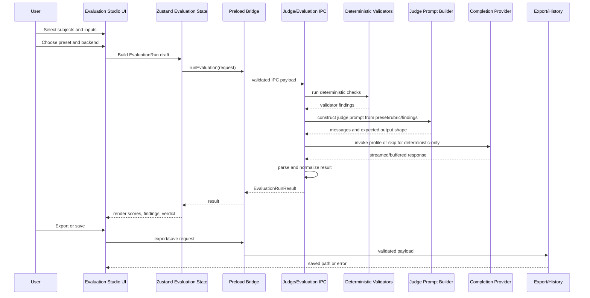

# Judge Mode / Evaluation Studio Architecture

Status: Proposed planning report
Initiative: `IN-2026-023-judge-mode-evaluation-studio-architecture`
Date: 2026-05-11

## Implementation Notes
- 2026-05-12 / `WP-JUDGE-005`: Added derived backend labels for existing completions profiles in Connections and Judge UI without provider schema migration, dedicated local provider work, or Judge runtime changes.
- 2026-05-12 / `WP-JUDGE-006`: Added the first renderer-only Evaluation Studio shell around the existing Compare/Judge surface, including manual two-answer start, without Judge runtime, IPC, provider, or shared contract changes.
- 2026-05-12 / `WP-JUDGE-007A`: Added an export-only `EvaluationRun` foundation for Judge Markdown/JSON exports, including dynamic score criteria, validator findings, and safe metadata. EvaluationRun history/storage remains deferred to `WP-JUDGE-007B`.
- 2026-05-12 / `WP-JUDGE-007B`: Added a separate file-backed EvaluationRun history store under app userData with bounded save/list/read/delete IPC and preload API. Chat history, Judge runtime, provider/settings, export IPC, and renderer UI remain unchanged.
- 2026-05-12 / `WP-JUDGE-007C`: Connected the existing EvaluationRun history preload API to Evaluation Studio UI with explicit save/list/open/delete controls. No auto-save, storage, IPC, preload, shared contract, main process, provider/settings, package, or dependency changes were added.
- 2026-05-12 / `WP-IN-2026-036`: Updated `CompareView` score display to discover and render dynamic criteria from `judgeResult.scores`, preserving legacy default ordering and avoiding Judge runtime, IPC, storage, export, shared contract, package, or dependency changes.
- 2026-05-12 / `WP-JUDGE-008`: Created the unified Judge MVP QA source of truth, including automated coverage inventory, manual smoke suite, evidence template, release confidence checklist, and docs completeness test. No runtime behavior, IPC, preload, shared contract, renderer, storage, export, provider, package, or dependency changes were made.

## 1. Product Summary
Judge Mode is the Dock capability for evaluating AI outputs. It should become an Evaluation Studio rather than a small hardening pass over the current CompareView. The Studio lets a user choose outputs from Chat, History, BrowserView/Web adapters, pasted text, and later files/workflows, then evaluate them with API models, local LLM profiles, deterministic validators, presets, and custom rubrics.

Why it belongs in Dock:
- Dock already coordinates multiple AI clients and agents.
- Dock already owns completions profiles, local Chat, History Hub, export, Prompt Router, BrowserView adapters, and future workflow orchestration.
- Evaluation is a cross-cutting user task: after generating answers, research, JSON, code, or agent outputs, the user needs to decide which result is trustworthy.

Why Judge before n8n:
- n8n workflows will need a stable artifact to consume. A normalized `EvaluationRun` gives future workflows an auditable input/output shape.
- Judge Mode can validate and compare agent outputs before automation chains act on them.
- Evaluation presets and validator contracts reduce ambiguity before workflow integration multiplies the number of sources and destinations.

Primary scenarios:
- Compare two or more Chat answers after one prompt.
- Compare research texts collected from different agents or web clients.
- Validate structured JSON against expected shape and prompt intent.
- Check whether a result followed the original prompt and constraints.
- Apply a user-written judge prompt or rubric.
- Review code/technical answers for correctness and risk.
- Critique UX/product/design output.
- Run multi-agent answer tournaments.
- Save or export evaluation reports for later review.

## 2. Current Implementation Snapshot
### `judgePipeline`
`src/main/services/judgePipeline.js` is the runtime source of truth for the current main-process Judge service. The TypeScript counterpart is a typed wrapper around the JS runtime file, consistent with ADR-002.

Current behavior:
- Loads `SYSTEM_PROMPT` from `src/shared/prompts/judge/system.md`.
- Loads `DEFAULT_RUBRIC` from `src/shared/prompts/judge/rubric.md`.
- Validates input with `isJudgeInput`.
- Resolves exactly one completions profile through `loadCompletions()` and `secureRetrieveToken()`.
- Selects provider by profile driver: `generic-http` uses `sendGenericHttp`, otherwise OpenAI-compatible uses `sendOpenAI`.
- Builds one prompt around `question` and ordered `answers`.
- Forces `response_format: { type: "json_object" }`.
- Streams completion chunks, concatenates content, extracts JSON by direct parse, fenced block parse, or brace slicing.
- Normalizes scores for `answer_1`, `answer_2`, etc.
- Returns fallback partial result when parsing fails.

Current limitations:
- The pipeline only understands answer comparison.
- It assumes at least two answers.
- It cannot model single-answer evaluation, structured validation, research comparison, or prompt adherence as first-class modes.
- It has no preset catalog.
- It has no deterministic validator stage.
- It has no explicit backend metadata in the result.
- It creates an `AbortController`, but the current UI does not expose run cancellation.

### Judge IPC
`src/main/ipc/judge.ipc.js` registers `judge:run` and emits `judge:progress`. The shared constants live in `src/shared/ipc/judge.ipc.*`.

Current behavior:
- Validates payload with `isJudgeInput`.
- Sends progress stages: `queued`, `running`, `parsing`.
- Calls `runJudge`.
- Returns `{ ok: true, result }` or `{ ok: false, error, details }`.

Current limitations:
- No run cancellation channel.
- No structured progress for deterministic validation, provider invocation, normalization, export/history save, or partial failures.
- Error details can include stack traces; future UX should keep sensitive data and tokens out of renderer-visible details.

### Shared Judge Types/Contracts
`src/shared/types/judge.ts` and `.js` define:
- `JudgeCriterion = "coherence" | "factuality" | "helpfulness"`.
- `JudgeInputAnswer`.
- `JudgeInput` with `requestId`, `judgeProfileId`, `question`, `answers`, optional `rubric`.
- `JudgeScore`.
- `JudgeResult`.
- `JudgeExportPayload`.
- runtime guards for input/result/export payloads.

Current limitations:
- Criteria are fixed and too narrow.
- `answers.length >= 2` prevents single-answer evaluation.
- No `evaluationType`, `presetId`, `subjects`, `validators`, `backend`, `outputFormat`, or metadata.
- `rawResponse` is loose and result schema does not separate deterministic findings from LLM findings.
- Export payload is tied to question/answers rather than `EvaluationRun`.

### Prompts/Rubric
`src/shared/prompts/judge/system.md` and `rubric.md` instruct the judge to return a fixed JSON structure with three criteria. They are suitable for prototype comparison but not for a preset-driven Studio.

Current limitations:
- Prompt text is global and static.
- Rubric override is a raw optional Markdown string.
- No prompt assembly model, preset-specific system text, validator instructions, prompt-injection isolation, or output-schema version.

### `judgeSlice`
`src/renderer/store/judgeSlice.ts` stores one `judgeRunning`, one `judgeResult`, one `judgeError`, error details, and one progress event. It calls `window.judge.run`.

Current limitations:
- No run list, run history, selected preset, selected subjects, backend metadata, validator results, or cancellation state.
- State shape is session-only and single-run oriented.

### `CompareView`
`src/renderer/react/views/CompareView.tsx` is the current user-facing Judge UI.

Current behavior:
- Loads compare draft from Zustand.
- Lets user edit question, answer selection, judge profile, and optional rubric.
- Runs Judge and renders a score table for fixed criteria.
- Exports Markdown/JSON through `window.exporter`.
- Shows progress and error details.

Current limitations:
- It is a comparison view, not an Evaluation Studio.
- Source selection is only Chat-prepared compare drafts plus local edits.
- Presets do not exist.
- Local/API backend distinction is not visible beyond profile name.
- Findings are only score rationales in a fixed table.
- JSON validation and deterministic checks are absent.
- Evaluation history is absent.

### Provider Dependency
Judge relies on completions profiles:
- `src/main/services/settings.js` stores profiles and secure token refs.
- `src/main/providers/openaiCompatible.js` sends OpenAI-compatible chat completions.
- `src/main/providers/genericHttp.js` sends templated generic HTTP calls.
- `src/renderer/react/views/CompletionsSettings.tsx` lets users create OpenAI-compatible and generic HTTP profiles.

Implication:
- MVP local LLM support can use an OpenAI-compatible local endpoint profile, such as a local `/v1/chat/completions` server.
- Generic HTTP can support non-standard local endpoints when response mapping is configured.
- A dedicated local provider profile is not required for MVP and should be a later gated decision.

### Export Dependency
`src/main/ipc/export.ipc.js`, `src/shared/ipc/export.ipc.ts`, preload exporter module, and `CompareView` support Judge Markdown/JSON export.

Current limitations:
- Export is tied to the prototype shape.
- Export does not persist a first-class `EvaluationRun`.
- Markdown table is hard-coded to the three current criteria.
- Export privacy controls are not explicit.

### Tests
Current `tests/**` includes registry, template variables, selector heuristics, HTTP helpers, history store, and stream parser tests. No dedicated Judge tests were found in the current test inventory.

## 3. Target Capability Model
### `EvaluationRun`
Top-level immutable record of one evaluation attempt.

Suggested fields:
- `id`
- `createdAt`
- `source`
- `evaluationType`
- `presetId`
- `subjects`
- `inputs`
- `criteria`
- `validators`
- `judgeProfileId`
- `backend`
- `status`
- `result`
- `exportRefs`
- `metadata`

### `EvaluationSubject`
The thing being evaluated or compared.

Examples:
- Chat assistant answer.
- BrowserView/Web adapter answer.
- History message or thread excerpt.
- Pasted text.
- Imported file later.
- Dock Agent result or future workflow output.

Suggested fields:
- `id`
- `kind`
- `label`
- `agentId`
- `clientId`
- `sourceRef`
- `content`
- `contentType`
- `metadata`

### `EvaluationInput`
The context that frames evaluation.

Examples:
- Original user prompt.
- Research task instructions.
- Expected JSON contract.
- Source documents or citations later.
- User-supplied constraints.

### `EvaluationAnswer`
Backward-compatible subject subtype for answer comparison. It should remain a convenience view over `EvaluationSubject`, not the only core model.

### `EvaluationPreset`
A reusable evaluation recipe.

Fields:
- `id`
- `title`
- `purpose`
- `evaluationType`
- `defaultCriteria`
- `defaultValidators`
- `inputExpectations`
- `outputShape`
- `promptTemplateRef`
- `version`

### `EvaluationRubric`
Rubric text and structured criteria for a run. It can come from a preset, a user override, or a custom prompt.

### `EvaluationCriterion`
Structured scoring dimension.

Fields:
- `id`
- `label`
- `description`
- `scale`
- `weight`
- `required`

### `EvaluationJudgeProfile`
A resolved judge backend selection, initially mapped to an existing completions profile.

Fields:
- `judgeProfileId`
- `driver`
- `baseUrlLabel`
- `model`
- `runtimeKind`
- `privacyLabel`
- `timeoutMs`

### `EvaluationValidator`
Deterministic check definition.

Examples:
- JSON parse.
- required keys.
- schema-lite shape.
- exact enum values.
- max/min length.
- citation presence.
- prompt keyword/constraint presence.

### `EvaluationResult`
Normalized outcome for UI/history/export.

Fields:
- `status`
- `scores`
- `rankings`
- `findings`
- `verdict`
- `summary`
- `validatorResults`
- `rawResponse`
- `metadata`

### `EvaluationFinding`
A granular issue, strength, or note.

Fields:
- `id`
- `subjectId`
- `criterionId`
- `severity`
- `source`
- `message`
- `evidence`
- `suggestion`

### `EvaluationExport`
Export artifact metadata.

Fields:
- `runId`
- `format`
- `path`
- `createdAt`
- `includeRaw`
- `includeInputs`
- `redactionMode`

## 4. Evaluation Modes
| Mode | Purpose | Minimum inputs | Primary outputs |
| --- | --- | --- | --- |
| Answer comparison | Compare two or more answers to one prompt | prompt/question, 2+ subjects | scores, ranking, verdict, rationale |
| Research comparison | Compare research quality across long outputs | task, 2+ research texts, optional citations | grounding findings, coverage, gaps |
| Structured JSON validation | Validate JSON output against expected contract | JSON text, expected shape/schema-lite, optional prompt | parse result, validator findings, optional LLM critique |
| Prompt adherence check | Check whether output followed prompt/constraints | original prompt, 1+ subjects | adherence score, missed constraints |
| Custom rubric judge | Let user define rubric/prompt | user rubric, 1+ subjects | custom criteria scores and findings |
| Code/technical answer review | Review correctness, completeness, risk | technical prompt, answer/code | issues, severity, confidence, suggestions |
| UX/design critique | Evaluate product/design output | brief, output, optional target audience | UX findings, tradeoffs, recommendations |
| Multi-agent answer tournament | Compare multiple agents over same task | prompt, 3+ subjects, optional bracket rules | ranking, pairwise notes, winner |
| Single answer quality assessment | Score one answer without comparison | prompt, 1 subject | quality score, findings, next-step suggestions |

## 5. Judge Backends
### API Judge via Completions Profiles
Use existing OpenAI-compatible profiles for hosted model APIs. This covers the current default path and avoids new provider work in MVP.

Requirements for future implementation:
- Select judge profile explicitly.
- Record profile name, driver, model, and timeout metadata.
- Never expose token values to renderer, logs, export, or raw debug dumps.

### Local LLM Judge via OpenAI-Compatible Local Endpoint
Users can create a completions profile with `driver = openai-compatible`, local `baseUrl`, and local model name. This should be the MVP local LLM story.

Examples of backend labels:
- `Local OpenAI-compatible`
- `Local network endpoint`
- `Cloud API`

The label should be inferred conservatively from URL shape and/or user setting later; do not hard-code privacy guarantees from a URL alone.

### Local LLM Judge via Generic HTTP Profile
Existing generic HTTP profiles can call non-standard local inference servers when request body and response paths are configured.

Use cases:
- Local endpoints that do not implement OpenAI chat completions.
- Internal HTTP services wrapping local models.

### Future Dedicated Local Provider Profile
A dedicated local provider profile can be considered later if profile UX needs first-class concepts such as model discovery, local-only badge, health check, hardware hints, context window, or offline availability.

This is not MVP because it changes provider settings model and likely requires gated migration/rollback.

### Deterministic Validators
Validators run without LLM judgment and produce reproducible findings. They should be used for:
- JSON parse and shape checks.
- Required field checks.
- Basic schema-lite validation.
- Prompt constraint presence checks where deterministic matching is appropriate.
- Export privacy warnings.

### Hybrid Evaluator
Hybrid evaluation runs deterministic validators first, then invokes the LLM judge with validator results included as evidence. The final UI should show:
- validator results;
- LLM findings;
- conflicts between validator results and LLM verdict;
- normalized verdict and confidence/partial status.

## 6. Preset Catalog
| Preset | Purpose | Default criteria | Input expectations | Output shape | Deterministic checks |
| --- | --- | --- | --- | --- | --- |
| General Answer Quality | General answer scoring/comparison | clarity, correctness, completeness, usefulness, style | prompt plus 1+ answers | scores, findings, verdict | optional length/empty checks |
| Research Quality | Judge research depth and grounding | coverage, source quality, factuality, uncertainty, synthesis | task plus research outputs, optional citations | score table, gaps, grounding findings | citation/link presence later |
| JSON Contract Check | Validate structured output | validity, contract adherence, completeness, semantic fit | JSON text, expected shape, prompt | parse result, validator findings, optional judge critique | JSON parse, keys, types, enums |
| Prompt Adherence | Check instruction following | constraint coverage, omissions, format, tone, refusal correctness | original prompt plus output | adherence score, missed constraints | keyword/constraint presence where configured |
| Factuality / Grounding | Evaluate factual support | support, unsupported claims, contradictions, citation relevance | answer plus context/source text | findings by claim/evidence | citation presence later |
| Code Review | Review technical/code answers | correctness, maintainability, edge cases, security, tests | prompt, code/answer, optional language | issues with severity, score, suggestions | fenced code detection, JSON parse if structured |
| Security Review | Identify security risk | secret leakage, injection, unsafe advice, privilege boundaries | output plus security context | risk findings, severity, verdict | secret-pattern warnings, dangerous token hints |
| UX / Product Review | Critique UX/product/design output | user fit, clarity, workflow, accessibility, tradeoffs | brief plus design/output | findings and recommendations | optional accessibility checklist later |
| Summarization Quality | Evaluate summary fidelity | coverage, faithfulness, compression, readability | source text plus summary | score, missing points, hallucination flags | source/summary length ratio |
| Custom User Rubric | User-defined criteria | user supplied | prompt/rubric plus subjects | user-defined scores/findings | optional configured validators |

## 7. Contract Direction
The current `JudgeInput/JudgeResult` is insufficient because it assumes:
- one comparison type;
- a `question` string instead of structured context;
- an `answers[]` list instead of subjects;
- at least two answers;
- one profile field without backend metadata;
- fixed criteria;
- optional raw rubric text only;
- LLM-only evaluation;
- prototype result/export shape.

Next-generation concept, not a code change in this initiative:

```ts
type EvaluationRunRequest = {
  requestId: string;
  evaluationType:
    | "answer_comparison"
    | "single_answer_quality"
    | "research_comparison"
    | "json_validation"
    | "prompt_adherence"
    | "custom_rubric"
    | "code_review"
    | "ux_product_review"
    | "multi_agent_tournament";
  presetId?: string;
  criteria?: EvaluationCriterion[];
  validators?: EvaluationValidator[];
  subjects: EvaluationSubject[];
  inputs?: EvaluationInput[];
  judgeProfileId?: string;
  model?: string;
  runtime?: {
    driver: "openai-compatible" | "generic-http" | "deterministic-only" | "future-local";
    backendLabel?: string;
    localOnlyExpected?: boolean;
  };
  customPrompt?: string;
  rubric?: EvaluationRubric | string;
  outputFormat?: "json" | "markdown" | "structured";
};

type EvaluationRunResult = {
  requestId: string;
  runId?: string;
  status: "ok" | "partial" | "failed";
  result: EvaluationResult;
  findings: EvaluationFinding[];
  verdict?: string;
  rawResponse?: unknown;
  metadata?: {
    presetId?: string;
    evaluationType: string;
    judgeProfileId?: string;
    model?: string;
    tokenUsage?: unknown;
    durationMs?: number;
  };
};
```

Compatibility direction:
- Keep prototype `JudgeInput` adapter path initially.
- Introduce `EvaluationRun` concepts behind a new or versioned contract only after `WP-JUDGE-001`.
- Avoid changing shared contracts in a docs-only initiative.

## 8. UX Model
### Evaluation Studio View
A new local view should become the main surface:
- source picker;
- preset picker;
- backend/profile picker;
- custom prompt/rubric editor;
- deterministic validation panel;
- run controls and progress;
- score/findings table;
- result detail drawer;
- export/history actions.

### CompareView Evolution
`CompareView` should evolve from destination view to one mode inside Evaluation Studio:
- "Compare answers" opens Studio with `evaluationType = answer_comparison`.
- Existing compare draft can be adapted into `subjects`.
- The fixed score table becomes a dynamic criteria table.

### Source Selection
Initial sources:
- Chat answers after latest user message.
- History messages or selected thread excerpts.
- Pasted text.
- Manual answer cards.

Later sources:
- imported files;
- BrowserView selected/extracted content;
- Form Runner outputs;
- future n8n workflow outputs.

### Preset Selection
Preset dropdown or segmented mode selector:
- mode first, preset second;
- show criteria preview;
- show whether validators apply;
- allow "Custom User Rubric".

### Judge Profile and Backend Selection
Use existing completions profiles initially:
- show profile name;
- show driver label: OpenAI-compatible or Generic HTTP;
- show model;
- optionally show inferred backend label, such as cloud/API or local endpoint.

### Custom Prompt/Rubric Editor
Editor requirements:
- Markdown rubric field;
- optional structured criteria later;
- clear reset-to-preset action;
- prompt injection warning when including untrusted answers in judge prompt.

### Validation Panel
For deterministic checks:
- parse status;
- per-validator pass/fail/warn;
- error location where possible;
- show whether LLM judge was skipped, run, or run with validator findings.

### Score Table and Findings
UI should separate:
- numeric scores;
- normalized ranking;
- findings by subject;
- validator findings;
- LLM findings;
- raw/partial parse warning.

### Export and History
Export should support:
- Markdown report;
- JSON `EvaluationRun`;
- optional raw response;
- optional include/exclude input content;
- redaction/privacy notes.

History should eventually support:
- list runs;
- filter by preset/type/profile/date/source;
- open run detail;
- rerun with same preset/backend.

## 9. Architecture Flow


Implementation principle:
- Renderer never accesses Node directly.
- New IPC channels must follow shared contract -> preload exposure -> main handler -> renderer consumer.
- Validator and provider execution should stay outside renderer.

## 10. Risks
| Risk | Impact | Mitigation |
| --- | --- | --- |
| Local LLM quality variability | Weak or inconsistent judge results | Backend labels, partial status, manual override, deterministic validators |
| Deterministic vs LLM verdict conflicts | User confusion | Show validator findings separately and flag conflicts |
| Hallucinated judge findings | False confidence | Ask judge to cite subject evidence; show raw evidence and confidence/partial state |
| JSON parsing failures | Broken results | Versioned output shape, parser hardening, fallback findings, tests |
| Long research context size | Cost/timeouts/truncation | Summarization/chunking later, context-size warnings |
| Token cost | Surprise cost | Profile/model metadata, estimated token display later |
| Privacy/local-only expectations | Sensitive data sent to cloud unexpectedly | Explicit backend labels and local-only confirmation in future UX |
| Provider timeout/retry/abort | Hanging runs | Add cancellation/progress/error-path work in `WP-JUDGE-001` or later |
| Score normalization | Incomparable scores across presets | Store scale/weights/criterion metadata |
| Prompt injection from answers | Judge prompt hijack | Strict prompt assembly with answer delimiters and untrusted-content warnings |
| Exporting sensitive inputs | Data leakage | Export options, redaction, include/exclude raw response |
| Provider settings migration | Breaks existing profiles | Defer dedicated local provider until separate gated workpack |

## 11. MVP Definition
MVP should be useful without a new provider system or database:
- Use existing completions profiles, including local OpenAI-compatible profiles.
- Use existing generic HTTP profiles for non-standard local endpoints.
- Store evaluation presets as static JSON/Markdown or shared data initially.
- Support answer comparison.
- Support custom rubric/custom judge prompt in a constrained way.
- Support JSON validation preset with deterministic parse/check stage.
- Keep deterministic validators simple and dependency-free initially.
- Export Markdown and JSON.
- Basic evaluation history is optional; if added, use a separately approved storage plan.
- Do not add a dedicated local provider profile yet.
- Do not add new dependencies in MVP unless separately approved.

## 12. Phased Roadmap
### Phase 0: Preflight and Contract Hardening
- Audit current contract gaps.
- Define compatibility path from `JudgeInput` to `EvaluationRun`.
- Harden parsing/fallback/error metadata.
- Decide progress/cancel semantics.

### Phase 1: Evaluation Presets and Custom Rubric
- Add preset catalog data.
- Map presets to criteria and prompt templates.
- Support custom user rubric safely.

### Phase 2: Structured JSON / Deterministic Validators
- Add JSON parse validator.
- Add schema-lite checks without dependency drift.
- Show validator findings separately from LLM findings.

### Phase 3: Local LLM Profile UX and Backend Labels
- Reuse completions profiles.
- Label OpenAI-compatible local endpoints and generic HTTP profiles.
- Avoid promising privacy unless user configured/confirmed local-only expectations.

### Phase 4: Evaluation History/Export
- Define `EvaluationRun` storage/export shape.
- Add Markdown/JSON export for new result shape.
- Add optional run history with privacy controls.

### Phase 5: Multi-Agent/Research Workflows
- Add research comparison.
- Add multi-agent tournament flow.
- Add long-context warnings and source selection from History/BrowserView.

### Phase 6: n8n Integration Can Consume `EvaluationRun` Later
- Publish stable EvaluationRun contract for future workflow connector.
- Let n8n consume evaluation artifacts after schema stabilizes.

## 13. Workpack Decomposition
### `WP-JUDGE-001 Current Contract Hardening`
Goal: Harden the current Judge contract and result handling before expanding modes.

Affected modules:
- shared Judge types/contracts;
- preload Judge sanitizer;
- main Judge IPC/pipeline;
- renderer judge slice/CompareView adapter;
- tests.

Allowed paths:
- `src/shared/ipc/judge.ipc.*`
- `src/shared/types/judge.*`
- `src/preload/modules/judge.js`
- `src/preload/utils/judge.js`
- `src/main/ipc/judge.ipc.*`
- `src/main/services/judgePipeline.*`
- `src/renderer/store/judgeSlice.ts`
- limited `src/renderer/react/views/CompareView.tsx`
- `tests/**`
- docs/indexes required by IPC changes.

Strong gates:
- shared contract change;
- preload bridge change;
- renderer consumer change;
- error detail/privacy review.

Verification:
- targeted Judge unit tests;
- preload build if bridge changes;
- `npm test`;
- manual compare two Chat answers;
- provider failure path.

### `WP-JUDGE-002 Evaluation Preset Catalog`
Goal: Add initial preset catalog and data model.

Affected modules:
- shared types/data;
- main prompt assembly later;
- renderer preset picker later;
- tests.

Allowed paths:
- future approved preset data path, for example `src/shared/presets/evaluation/**`;
- relevant shared types if approved;
- tests and docs.

Strong gates:
- new shared data/contract path;
- prompt/rubric behavior change.

Verification:
- catalog validation test;
- renderer import/build if UI consumes it later.

### `WP-JUDGE-003 Custom Rubric / Custom Judge Prompt`
Goal: Support custom user rubric and custom judge prompt in a structured, safe way.

Affected modules:
- shared evaluation request type;
- preload sanitizer;
- main prompt builder;
- renderer editor;
- tests.

Allowed paths:
- scoped shared/preload/main/renderer files defined by workpack.

Strong gates:
- prompt injection risk;
- raw prompt storage/export policy;
- shared contract change.

Verification:
- custom rubric happy path;
- malformed custom prompt path;
- no token/secret exposure.

### `WP-JUDGE-004 JSON / Schema Validator Mode`
Goal: Add deterministic JSON validation mode.

Affected modules:
- shared validator types;
- main validator service;
- renderer validation panel;
- tests.

Allowed paths:
- future validator service path;
- shared validator/result types;
- renderer validation UI;
- tests.

Strong gates:
- dependency/package change if a schema library is proposed;
- data/result format changes.

Verification:
- valid JSON;
- invalid JSON;
- missing required keys;
- deterministic-only run;
- hybrid validator plus LLM run.

### `WP-JUDGE-005 Local LLM Backend Labeling and UX`
Goal: Make API/local backend selection understandable while reusing completions profiles.

Affected modules:
- Completions Settings labels;
- Judge/Evaluation profile picker;
- optional shared profile metadata later.

Allowed paths:
- renderer settings and Evaluation Studio UI files;
- no settings schema migration unless approved.

Strong gates:
- provider settings model change;
- privacy guarantee wording.

Verification:
- profile list shows driver/model labels;
- local OpenAI-compatible profile can be selected;
- generic HTTP profile can be selected.

### `WP-JUDGE-006 Evaluation Studio UI Shell`
Goal: Create Evaluation Studio as a first-class local view and route CompareView into it.

Affected modules:
- React views/components;
- Zustand state;
- local navigation;
- tests/smoke.

Allowed paths:
- `src/renderer/react/**`;
- `src/renderer/store/**`;
- docs/tests as approved.

Strong gates:
- no direct Node access;
- preload-only IPC;
- avoid replacing existing Compare flow without rollback.

Verification:
- Studio opens from Chat Compare;
- pasted text source works;
- preset/profile selectors render;
- result panel handles empty/loading/error states.

### `WP-JUDGE-007 EvaluationRun History and Export`
Goal: Save/export normalized EvaluationRun artifacts.

Affected modules:
- main history/export services;
- shared export/evaluation types;
- preload exporter/history bridge;
- renderer history/export UI;
- tests.

Allowed paths:
- scoped history/export/evaluation files after storage plan approval.

Strong gates:
- history/storage format and migration;
- exporting sensitive inputs;
- rollback plan.

Verification:
- export MD/JSON;
- save/list/open run if history is included;
- redaction/include-raw options;
- provider failure run not saved unless designed.

### `WP-JUDGE-008 Tests and Smoke Suite`
Goal: Add test coverage and manual smoke documentation for Judge Mode.

Affected modules:
- tests;
- smoke docs;
- possibly fixtures.

Allowed paths:
- `tests/**`;
- docs QA/smoke paths;
- no runtime changes except under separate approved fixes.

Strong gates:
- test requiring new dependencies;
- brittle external provider tests.

Verification:
- `npm test`;
- manual smoke checklist.

### `WP-JUDGE-009 Research Comparison Mode`
Goal: Add long-form research comparison with source/history support.

Affected modules:
- Evaluation Studio UI;
- prompt builder;
- optional History source picker;
- tests.

Allowed paths:
- scoped renderer/store/main/shared paths after earlier phases.

Strong gates:
- context-size handling;
- source privacy;
- history data format if persisting excerpts.

Verification:
- compare pasted research texts;
- compare history excerpts;
- long input warning.

### `WP-JUDGE-010 n8n EvaluationRun Integration Preflight`
Goal: Prepare future n8n connector to consume stable EvaluationRun artifacts.

Affected modules:
- docs/API planning;
- future integration contracts only after approval.

Allowed paths:
- docs/planning and architecture docs initially.

Strong gates:
- connector runtime implementation;
- credential/network behavior;
- dependency changes.

Verification:
- schema review;
- no runtime changes in preflight.

## 14. Recommended First Implementation Workpack
Recommended first runtime workpack: `WP-JUDGE-001 Current Contract Hardening`.

Reason:
- The current `JudgeInput/JudgeResult` cannot safely carry presets, validators, single-answer evaluation, backend metadata, or history/export metadata.
- Expanding UI first would lock the product into prototype assumptions.
- Adding presets first as docs/data is useful, but runtime needs a compatibility and contract hardening pass before UI and validators consume the new shape.
- `WP-JUDGE-001` can be scoped to compatibility hardening and tests without implementing the full Studio.

Fallback first workpack if Human wants docs/data before runtime: `WP-JUDGE-002 Evaluation Preset Catalog`.

Use `WP-JUDGE-002` first only if it is explicitly constrained to static docs/data and does not require shared/preload/main/renderer contract changes.

## 15. Manual Smoke Checklist
- [ ] Compare two Chat answers from the latest user prompt.
- [ ] Compare pasted research texts.
- [ ] Run with an API judge profile.
- [ ] Run with a local OpenAI-compatible profile.
- [ ] Run with a generic HTTP local/custom profile.
- [ ] Run custom rubric.
- [ ] Run JSON validation preset.
- [ ] Export result as Markdown.
- [ ] Export result as JSON.
- [ ] Provider failure path shows non-secret error.
- [ ] No profile state shows actionable empty/error state.
- [ ] Malformed judge JSON response produces partial result/finding.
- [ ] Deterministic validator failure is visible separately from LLM verdict.
- [ ] No runtime path bypasses preload or exposes tokens.
